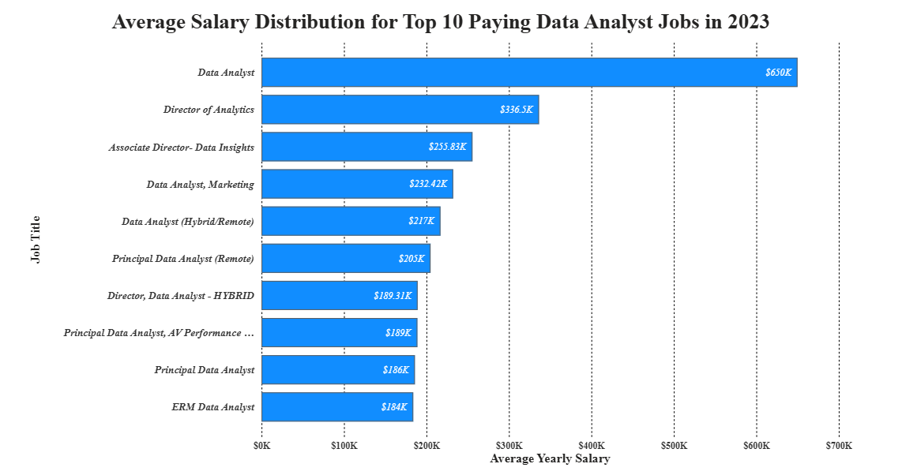
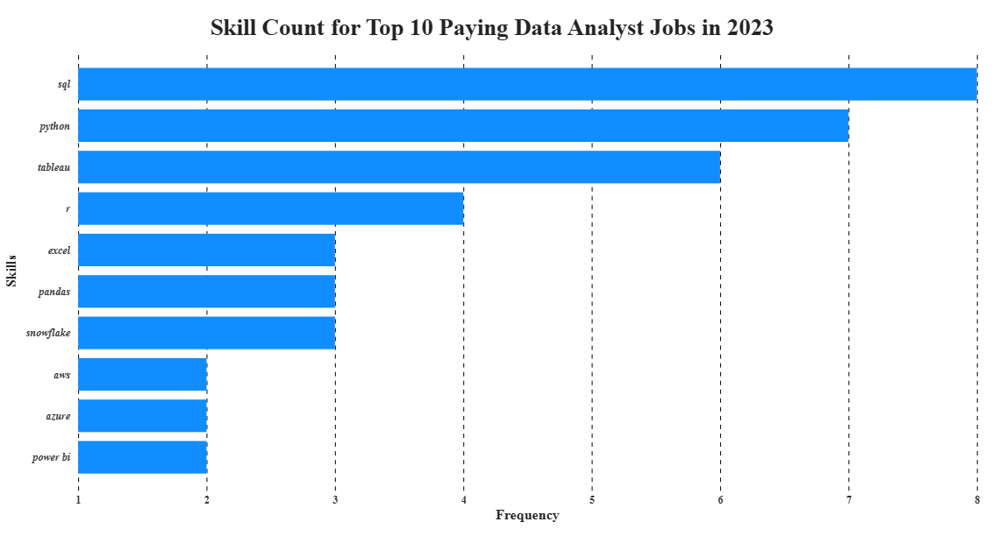

# 🔍 Introduction
📊 **Exploring the Data Analyst Job Market**

This project examines the data analytics job market by identifying 💰 top-paying Data Analyst positions, 🔥 the most sought-after skills, and 🎯 the intersection of high demand and high compensation.

🛠️ Through SQL-based analysis, the project provides actionable insights into current industry trends and career opportunities.

🔗 SQL queries: [project_sql folder](/project_sql/)

# 📖 Background

Driven by a desire to better understand the data analyst job market, this project explores the relationship between salaries, skill demand, and career opportunities in data analytics. The goal was to identify high-paying roles, uncover the most sought-after skills, and determine which skills offer the strongest combination of demand and earning potential.

The dataset used in this analysis was sourced from a publicly available SQL learning project provided through a YouTube educational course. It contains detailed information on job postings, including job titles, salaries, locations, and required skills, making it a valuable resource for analyzing industry trends.

### Using SQL, this project seeks to answer the following questions:

1. 💰 What are the top-paying Data Analyst jobs?
2. 🛠️ What skills are required for these top-paying jobs?
3. 📈 What skills are most in demand for Data Analysts?
4. 🚀 Which skills are associated with higher salaries?
5. 🎯 What are the most optimal skills to learn for career growth and compensation?

# 🛠️ Tools Used

To analyze the data analyst job market and uncover meaningful insights, I leveraged the following tools and technologies:

* 🗄️ **SQL** – The foundation of this analysis, used to query, manipulate, and extract insights from the dataset.

* 🐘 **PostgreSQL** – The database management system used to store and manage job posting data efficiently.

* 💻 **Visual Studio Code (VS Code)** – The primary development environment for writing, testing, and executing SQL queries.

* 📊 **Power BI** – Used to create interactive visualizations and dashboards, transforming query results into clear and actionable insights.

* 🌿 **Git & GitHub** – Used for version control, project tracking, and sharing SQL scripts and analysis in a collaborative and organized manner.


# 🔍 Analysis

Each query in this project was designed to investigate a specific aspect of the Data Analyst job market. Here's how I approached each questions:

### 1️⃣ Top-Paying Data Analyst Jobs
#### 📌 Objective
Identify the highest-paying Data Analyst roles by filtering for Data Analyst positions with specified salaries and remote work opportunities.

#### 💻 SQL Query

```sql
SELECT
    job_postings_fact.job_id,
    company_dim.name AS coompany_name,
    job_postings_fact.job_title,
    job_postings_fact.job_location,
    job_postings_fact.job_schedule_type,
    job_postings_fact.salary_year_avg,
    job_postings_fact.job_posted_date
FROM
    job_postings_fact
LEFT JOIN company_dim
       ON job_postings_fact.company_id = company_dim.company_id
WHERE
    job_title_short = 'Data Analyst' AND
    job_location = 'Anywhere' AND
    salary_year_avg IS NOT NULL 
ORDER BY
    salary_year_avg DESC
LIMIT
    10;
```
#### 📊 Visualization


*Bar chart created in Power BI using SQL query results, illustrating the top 10 highest-paying Data Analyst jobs in 2023.*

#### 💡 Insights

* 💰 **High Salary Potential:** Top-paying Data Analyst roles offer salaries ranging from $184K to $650K annually.
* 🏢 **Diverse Industries:** Companies across technology, finance, healthcare, and telecommunications offer competitive salaries.
* 🌍 **Remote Opportunities:** All top-paying positions are remote, highlighting the value of location-independent work.
* 📈 **Senior Roles Pay More:** Director and Principal-level positions dominate the highest-paying jobs.
* 🎯 **Analytics Expertise Matters:** Employers offer premium compensation for strong analytical and data-driven decision-making skills.

### 2️⃣ Skills Required for Top-Paying Data Analyst Jobs
#### 📌 Objective

Identify the skills most frequently required by the top 10 highest-paying Data Analyst positions. This analysis helps reveal which technical competencies employers value most in high-paying roles and provides guidance on the skills professionals should prioritize to maximize their earning potential.

#### 💻 SQL Query

```sql
WITH top_paying_jobs AS (
    SELECT
        job_postings_fact.job_id,
        company_dim.name AS coompany_name,
        job_postings_fact.job_title,
        job_postings_fact.salary_year_avg
    FROM
        job_postings_fact
    LEFT JOIN company_dim
        ON job_postings_fact.company_id = company_dim.company_id
    WHERE
        job_title_short = 'Data Analyst' AND
        job_location = 'Anywhere' AND
        salary_year_avg IS NOT NULL
    ORDER BY
        salary_year_avg DESC
    LIMIT
        10
)

SELECT 
    top_paying_jobs.*,
    skills_dim.skills
FROM top_paying_jobs
INNER JOIN skills_job_dim
       ON top_paying_jobs.job_id = skills_job_dim.job_id
INNER JOIN skills_dim
       ON skills_job_dim.skill_id = skills_dim.skill_id
ORDER BY
    salary_year_avg DESC
```
#### 📊 Visualization


*Bar chart created in Power BI using SQL query results, illustrating the skills for the top 10 highest-paying Data Analyst jobs in 2023.*

#### 💡 Insights

* 🏆 **SQL Leads the Way:** SQL appears in 8 of the top 10 highest-paying Data Analyst roles, making it the most in-demand skill.
* 🐍 **Python is Essential:** Python ranks second with 7 occurrences, highlighting its importance for data analysis and automation.
* 📊 **Visualization Matters:** Tableau appears in 6 roles, emphasizing the value of data storytelling and dashboarding.
* ☁️ **Cloud Skills Add Value:** Snowflake, AWS, and Azure are present across several high-paying positions, reflecting the growing importance of cloud technologies.
* 🎯 **Winning Skill Combination:** SQL, Python, and Tableau form the most common skill set among top-paying Data Analyst jobs.

### 3️⃣ Most In-Demand Skills for Data Analysts

#### 📌 Objective
This query helped identify the skills most frequently requested in job postings, directing focus to areas with high demand.

#### 💻 SQL Query
```sql
SELECT
    COUNT (skills_dim.skill_id) AS demand_count,
    skills_dim.skills
FROM 
    job_postings_fact
INNER JOIN skills_job_dim
       ON job_postings_fact.job_id = skills_job_dim.job_id
INNER JOIN skills_dim
       ON skills_job_dim.skill_id = skills_dim.skill_id
WHERE
    job_title_short = 'Data Analyst'
GROUP BY
    skills_dim.skills
ORDER BY
    demand_count DESC
LIMIT
    5
```

#### 📊 Visualization

| Demand Count| Skills |
|-------------|--------|
|92628        |sql     |
|67031        |excel   |
|57326        |python  |
|46554        |tableau |
|39468        |power bi|


*Table of the demand for the top 5 skills in data analyst job postings.*

#### 💡 Insights
* 🏆 **SQL:** SQL is the foundation of data analytics, appearing in significantly more job postings than any other skill.
* 🔄 **Traditional and modern tools coexist:** While Python powers advanced analytics, Excel remains one of the most sought-after skills, showing that business reporting and spreadsheet analysis are still essential.
* 📊 **Data storytelling is a priority:** The strong demand for Tableau and Power BI indicates that employers value analysts who can translate data into actionable insights.
* 🎯 **Well-Rounded Skill Set:** The most marketable analysts combine technical, business, and visualization skills, rather than specializing in a single tool.

### 4️⃣ Skills Associated with Higher Salaries

#### 📌 Objective

Identify the skills linked to the highest average salaries among Data Analyst roles. This analysis helps uncover which specialized technologies and tools command premium compensation in the job market.

#### 💻 SQL Query

```sql
SELECT
    skills_dim.skills,
    ROUND(AVG(job_postings_fact.salary_year_avg), 2) AS avg_salary
FROM
    job_postings_fact
INNER JOIN skills_job_dim
       ON job_postings_fact.job_id = skills_job_dim.job_id
INNER JOIN skills_dim
       ON skills_job_dim.skill_id = skills_dim.skill_id
WHERE
    job_postings_fact.job_title_short = 'Data Analyst' AND
    job_postings_fact.salary_year_avg IS NOT NULL
GROUP BY
    skills_dim.skills
ORDER BY
    avg_salary DESC
LIMIT
    25
```
#### 📊 Visualization

| Skills	| Average Salary ($) |
|-----------|--------------------|
|svn        |	400000           |
|solidity   |	179000           |
|couchbase  |	160515           |
|datarobot  |	155485.5         |
|golang     |	155000           |
|mxnet      |	149000           |
|dplyr      |	147633.33        |
|vmware     |	147500           |
|terraform  |	146733.83        |
|twilio     |	138500           |


*Table of the average salary for the top 10 paying skills for data analysts.*

> **Note:** The SQL query returned the top 25 highest-paying skills. To maintain readability, only the top 10 skills are displayed in the table above.

#### 💡 Insights

* 💎 **Specialized Skills Drive Higher Salaries:** Niche technologies command premium compensation due to their scarcity in the talent market.

* 🤖 **AI & ML Skills Are Highly Valued:** Machine learning frameworks and AI-related tools consistently appear among the highest-paying technologies.

* ☁️ **Data Infrastructure Expertise Pays More:** Skills related to cloud platforms, automation, and large-scale data systems are associated with higher salaries.

* 🎯 **Rarity Creates Value:** The highest-paying skills are often not the most in-demand, highlighting the salary advantage of specialized expertise.

### 5️⃣ Most Optimal Skills to Learn

#### 📌 Objective

Identify the skills that provide the best balance between market demand and salary potential for Data Analysts. By combining demand and salary data, this analysis highlights the technologies that can maximize both employability and earning potential.

#### 💻 SQL Query

```sql
SELECT
    skills_dim.skill_id,
    skills_dim.skills,
    COUNT (skills_dim.skill_id) AS demand_count,
    ROUND(AVG(job_postings_fact.salary_year_avg), 2) AS avg_salary
FROM
    job_postings_fact
INNER JOIN skills_job_dim
    ON job_postings_fact.job_id = skills_job_dim.job_id
INNER JOIN skills_dim
    ON skills_job_dim.skill_id = skills_dim.skill_id
WHERE
    job_title_short = 'Data Analyst' AND
    job_postings_fact.salary_year_avg IS NOT NULL
GROUP BY
    skills_dim.skill_id
HAVING
    COUNT (skills_dim.skill_id) > 10
ORDER BY
    avg_salary DESC,
    demand_count DESC
LIMIT 25;
```

#### 📊 Visualization

| Skills 	| Demand Count |	Average Salary ($) |
|-----------|--------------|-----------------------|
|kafka      |	40         |	129999.16          |
|pytorch    |	20         |	125226.2           |
|perl       |	20         |	124685.75          |
|tensorflow |	24         |	120646.83          |
|cassandra  |	11	       |    118406.68          |
|atlassian  |	15         |	117965.6           |
|airflow    |	71         |	116387.26          |
|scala      |	59         |	115479.53          |
|linux      |	58         |	114883.2           |
|confluence |	62         |	114153.12          |

*Table displaying the top 10 most optimal skills based on a combination of demand and average salary for Data Analyst roles.*

> **Note:** The SQL query returned 25 optimal skills. To maintain readability, only the top 10 skills are displayed in the table above.

#### 💡 Insights

* ⚖️ **Balance Creates Value:** The most optimal skills are those that combine strong market demand with above-average salaries, rather than excelling in only one category.
* ☁️ **Data Engineering Skills Stand Out:** Technologies such as Kafka, Airflow, Cassandra, and Scala appear frequently, highlighting the growing overlap between analytics and data engineering.
* 🤖 **AI & Big Data Skills Offer Strong Returns:** PyTorch and TensorFlow demonstrate that machine learning expertise can significantly increase earning potential while remaining relevant in the analytics market.
* 🎯 **Modern Analysts Need More Than Reporting Skills:** The highest-value skill set extends beyond traditional analytics tools and includes cloud, data infrastructure, and scalable data processing technologies.

# 🎓 What I Learned

This project marked my transition from being a complete SQL beginner to confidently analyzing real-world datasets using SQL.

Throughout this project, I developed a strong understanding of SQL fundamentals, including query syntax, filtering, sorting, joins, aggregations, CTEs, and database management concepts. More importantly, I learned how to transform raw data into meaningful insights by writing SQL queries independently and answering business-focused questions.

By working through this analysis, I gained hands-on experience in:

* 🗄️ Writing and optimizing SQL queries to extract valuable insights from large datasets.
* 🔗 Working with multiple tables using joins and relational database concepts.
* 📊 Analyzing job market trends through data-driven investigation.
* 📈 Creating clear and impactful visualizations in Power BI.
* 🧠 Translating query results into actionable business insights and recommendations.

This project strengthened both my technical SQL skills and my ability to approach data analysis with a problem-solving mindset.

# 🏁 Conclusion

This project provided valuable insights into the Data Analyst job market by exploring salary trends, in-demand skills, and the relationship between skill demand and earning potential. The analysis revealed that while foundational skills like SQL, Excel, and Python remain highly sought after, specialized technologies in data engineering, cloud computing, and machine learning often command higher salaries.

Beyond the market insights, this project strengthened my SQL proficiency and demonstrated how data can be transformed into actionable information through querying, analysis, and visualization. It serves as both a reflection of current industry trends and a practical showcase of my data analytics skills.

# Test Image

